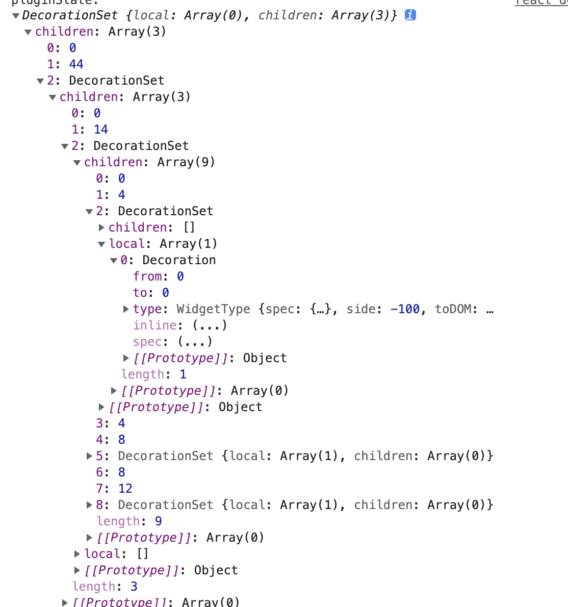

## Decorations 的功能

> Decorations make it possible to influence the way the document is drawn, without actually changing the document.

这里引用官网的话，`decoration`的功能就是影响`PmNode`如何绘制，却无需改变 prosemirror 内部`state.doc`的结构。prosemirror 的`customNodeView`也可以做到这一点，但是`customNodeView`更接近`PmNode`，`decoration`更像`PmMark`多一点。

## Decoration 和 DecorationSet 的数据结构



## Decoration 是如何注入到 prosemirror 的

```js
const editorState = EditorState.create({
    plugins: [new Plugin({
        props: {
            decorations?: ((this: ThisT, state: EditorState<S>) => DecorationSet<S> | null | undefined) | null | undefined;
        }
    })]
})

new EditorView(
    document.querySelector("#editor"),
    {state: editorState}
),
```

## Decoration 是如何工作的

这里先介绍一下`editorView`的`someProp`方法

```js
constructor(place, props) {
    this._props = props
    // :: EditorState
    // The view's current [state](#state.EditorState).
    this.state = props.state

    this.directPlugins = props.plugins || []
    ...
}

someProp(propName, f) {
    let prop = this._props && this._props[propName] let value

    if (prop != null && (value = f ? f(prop) : prop)) {
        return value
    }

    for (let i = 0; i < this.directPlugins.length; i++) {
      let prop = this.directPlugins[i].props[propName]
      if (prop != null && (value = f ? f(prop) : prop)) {
          return value
      }
    }

    let plugins = this.state.plugins
    if (plugins) for (let i = 0; i < plugins.length; i++) {
      let prop = plugins[i].props[propName]
      if (prop != null && (value = f ? f(prop) : prop)) {
          return value
      }
    }
}
```

## editorView 是如何更新的

```js
constructor(place, props) {
    ...
    this.nodeViews = buildNodeViews(this)
    this.docView = docViewDesc(this.state.doc,
        computeDocDeco(this),
        viewDecorations(this),
        this.dom,
        this)
}
```

我们更新状态会调用`editorView.dispatch`

```js
dispatch(tr) {
    let dispatchTransaction = this._props.dispatchTransaction
    if (dispatchTransaction) dispatchTransaction.call(this, tr)
    else this.updateState(this.state.apply(tr))
}
```

在`updateState`中会比对`state`和`dom`是否匹配，不匹配会销毁`this.docView`，并在此构建

```js
if (redraw || !this.docView.update(state.doc, outerDeco, innerDeco, this)) {
    this.docView.updateOuterDeco([]);
    this.docView.destroy();
    this.docView = docViewDesc(state.doc, outerDeco, innerDeco, this.dom, this);
}
```

### 看一下 docView 的签名

```js
export function docViewDesc(doc, outerDeco, innerDeco, dom, view) {
    applyOuterDeco(dom, outerDeco, doc);
    return new NodeViewDesc(null, doc, outerDeco, innerDeco, dom, dom, dom, view, 0);
}
```

这里 outerDeco 指代的是 DocDeco, outerDeco 是一个包含了一个 decoration.node 的数组

```js
function computeDocDeco(view) {
    let attrs = Object.create(null);
    attrs.class = 'ProseMirror';
    attrs.contenteditable = String(view.editable);
    attrs.translate = 'no';

    view.someProp('attributes', value => {
        if (typeof value == 'function') value = value(view.state);
        if (value)
            for (let attr in value) {
                if (attr == 'class') attrs.class += ' ' + value[attr];
                if (attr == 'style') {
                    attrs.style = (attrs.style ? attrs.style + ';' : '') + value[attr];
                } else if (!attrs[attr] && attr != 'contenteditable' && attr != 'nodeName')
                    attrs[attr] = String(value[attr]);
            }
    });

    // 这里docoration.node(from, to, new NodeType(attrs, spec=noSpec))
    return [Decoration.node(0, view.state.doc.content.size, attrs)];
}
```

#### innerDoc 是如何生成的

```js
export function viewDecorations(view) {
    let found = [];
    view.someProp('decorations', f => {
        let result = f(view.state);
        if (result && result != empty) found.push(result);
    });
    if (view.cursorWrapper)
        found.push(DecorationSet.create(view.state.doc, [view.cursorWrapper.deco]));
    return DecorationGroup.from(found);
}

static create(doc, decorations) {
    return decorations.length ? buildTree(decorations, doc, 0, noSpec) : empty
}

function buildTree(spans, node, offset, options) {
    let children = [], hasNulls = false
    node.forEach((childNode, localStart) => {
        let found = takeSpansForNode(spans, childNode, localStart + offset)
        if (found) {
        hasNulls = true
        let subtree = buildTree(found, childNode, offset + localStart + 1, options)
        if (subtree != empty)
            children.push(localStart, localStart + childNode.nodeSize, subtree)
        }
    })
    let locals = moveSpans(hasNulls ? withoutNulls(spans) : spans, -offset).sort(byPos)
    for (let i = 0; i < locals.length; i++) if (!locals[i].type.valid(node, locals[i])) {
        if (options.onRemove) options.onRemove(locals[i].spec)
        locals.splice(i--, 1)
    }
    return locals.length || children.length ? new DecorationSet(locals, children) : empty
}
```

## decorations 是如何变成 dom 的

decorations => viewDesc => dom

docViewDesc 函数调用返回 NodeViewDesc 的实例，NodeViewDesc 在 construcotr 会调用 updateChildren，最后调用 renderDescs 生成 dom
